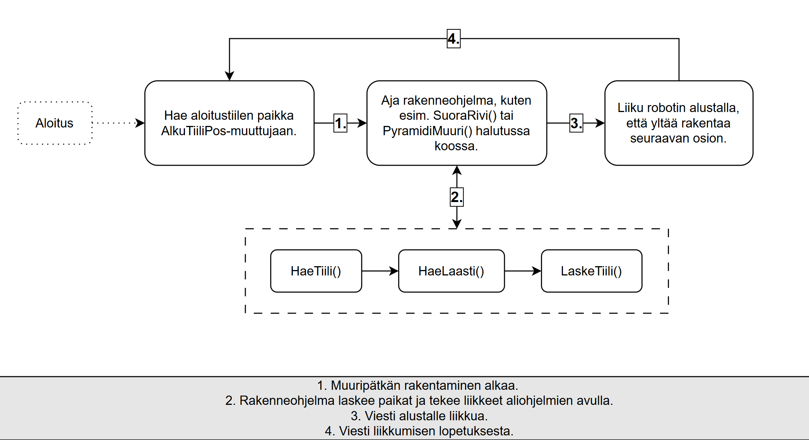

# 🧱 Muurausohjelma — Robotic Bricklaying System

An automated bricklaying system built with an **ABB Gofa** collaborative robot arm, **OnRobot 2FG7** gripper, and **SICK PLOC2D** vision camera. The robot can build various brick wall structures using real bricks and mortar, with the operator controlling it through a custom **ABB AppStudio** HMI. Set parameters of brick size and amount of bricks you want per wall section. Rotation of wall section can be controlled with workobject uframe. Mortar extrucion from attached hose on tool or from stationary extrucion place to each bricks surface.

> **Note:** This system has been tested in lab conditions with real bricks and mortar.

---

<table>
  <tr>
    <td width="30%" valign="top">
      <h3>🎬 Demo</h3>
      
       
      <i>Demo (Sped up x4 and with a short cut to not show peoples faces.)</i>
    </td>
    <td width="70%" valign="top">
      <h3>⚙️ How It Works</h3>
      <ol>
        <li><strong>Set Starting Position</strong> — The starting point is read from the robot arm's current TCP (Tool Centre Point) via <code>CRobT()</code>, or it can be manually or programmatically assigned to the <code>AlkuTiiliPos</code> variable.</li>
        <li><strong>Vision Detection</strong> — The SICK PLOC2D camera locates the next brick on the table using saved detection jobs.</li>
        <li><strong>Pick</strong> — The OnRobot 2FG7 gripper picks up the located brick.</li>
        <li><strong>Mortar Extrusion</strong> <em>(optional)</em> — A hose-based mortar extruder attached to the arm applies mortar on the wall before brick placement. Stationary mortar extruder is also an option.</li>
        <li><strong>Place</strong> — The brick is moved to its calculated position and placed with an appropriate approach direction to avoid collisions with previously placed bricks.</li>
        <li><strong>Repeat</strong> — The process loops until the chosen wall structure is complete.</li>
      </ol>
      <blockquote>The system does <strong>not</strong> fully perform collision checking with the environment — the operator is responsible for ensuring a clear workspace.</blockquote>
    </td>
  </tr>
</table>

---

## 📐 Program Logic

1.Construction of the wall section begins
2.The structural program calculates the positions and executes movements using subprograms.
3.Message for robot base to move.
4.Message from base that movement is done.

---

## 🏗️ Wall Structures

The system can build the following structures based on configurable brick dimensions and count:

| Structure | Procedure | Description |
|-----------|-----------|-------------|
| **Straight Row** | `SuoraRivi` | A single straight row of bricks in a chosen direction (±X or ±Y) |
| **Pyramid / Triangle** | `PyramidiMuuri` | A pyramid-shaped wall, each layer narrower than the one below |
| **Inverted Pyramid** | `PyramidUpsideDown` | An upside-down pyramid — requires support walls on the sides |
| **Thick Wall** | `PaksuMuuri` | A wide wall built in three-brick sections |
| **Corner** | `KulmanMuuraus` | An L-shaped corner structure with alternating orientations. Short demo program. |
| **Curved Wall** | `KaariMuuri` | An arc-shaped wall *(experimental)* |

---

## 🧩 Project Modules

| File | Description |
|------|-------------|
| `Muuripyramidi.modx` | Main program module — contains all wall-building procedures, brick pick & place logic, mortar extrusion, and some safety configurations |
| `Muuttujat.modx` | Global variables — brick dimensions, speed settings, starting positions, brick weight data, and WorldZone safety limits |
| `AppStudioModuli.modx` | HMI interface module — procedures callable from the ABB AppStudio touchscreen app for selecting structures and settings |
| `Calib_tPLOC2DGripper.modx` | Auto-generated TCP calibration data for the PLOC2D camera + gripper tool |
| `HMI_ABB_Appstudio.zip` | The ABB AppStudio HMI project files (touchscreen operator interface) |

---

## 🤖 Hardware

| Component | Model | Role |
|-----------|-------|------|
| Robot Arm | **ABB Gofa CRB 15000** | 6-axis collaborative robot for pick & place. |
| Controller | **ABB OmniCore C30** | Controller for system. |
| HMI | **ABB FlexPendant** | Custom touchscreen interface for the operator made in ABB AppStudio. |
| Gripper | **OnRobot 2FG7** | Electric parallel gripper for grasping bricks. Used custom 3D printed fingers because of large bricks. |
| Camera | **SICK PLOC2D-611-6R ABB KIT GOFA** | Vision system for locating bricks on the table. |

---

## 📏 Configurable Parameters

Brick dimensions and other key values are set in `Muuttujat.modx` and can be adjusted via the HMI:

- **Brick Length** — `TiiliPituus` (default: 260 mm for large)
- **Brick Height** — `TiiliKorkeus` (default: 63 mm for large)
- **Brick Width** — `TiiliLeveys` (default: 130 mm)
- **Mortar Gap** — `LaastiRako` (default: 3 mm)
- **Brick Count** — `Tiilien_Maara` (default: 10 ,but it's too much to reach for large bricks)
- **Movement Speeds** — Four presets from slow (v100) to full (v1200)

---

## 🛠️ Programming Language

The robot program is written in **ABB RAPID**, the native programming language for ABB robot controllers. The modules use `.modx` file extensions. HMI was made with ABB AppStudio.

---

## 👤 Author

**JAOSAutom**

---

## ⚠️ Disclaimer

This is a research/thesis project. The robot does **not** have built-in awareness of obstacles or reach limits. Always ensure the workspace is clear and follow all safety procedures when operating the system.
This readme is written by an LLM and has been proofread by a human.
